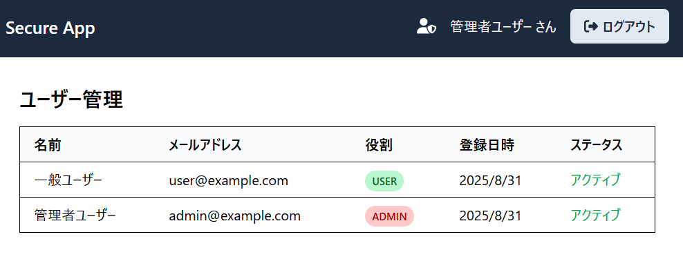

# Secure Auth App with Next.js

## 1. アプリケーション概要

本アプリケーションは、大学の「知能情報実験実習2」の実装課題として作成した、堅牢なセキュリティ設計を特徴とするWebアプリケーションです。Next.js (App Router) を用いて、モダンなトークンベース認証（JWT）と、それに関連する高度なセキュリティ機能をゼロから実装しました。

単なるログイン機能に留まらず、実際のWebサービスで求められるような多層的な防御機構や、ユーザー・管理者双方の視点に立った機能性を追求し、**合計20時間以上**を費やして開発しました。

-   **GitHubリポジトリ**: `https://github.com/yuga-school/nextjs-secure-auth-app`
-   **開発者**: `yuga-school`

---

## 2. 機能一覧

本アプリケーションは、以下の機能を実装しています。

### 基本認証機能
-   ✅ **ユーザー登録（サインアップ）**
-   ✅ **ログイン / ログアウト**
-   ✅ **ログイン状態の永続化**

### 追加実装機能（課題要件）
-   ✅ **① 連続ログイン失敗によるアカウントロック**
-   ✅ **② メールによるパスワードリセット**
-   ✅ **③ ログイン履歴の表示**
-   ✅ **④ 管理者向けダッシュボード（ユーザー管理）**

### UI/UX改善機能
-   ✅ **パスワード強度メーター**
-   ✅ **パスワード表示/非表示トグル**
-   ✅ **Toast（ポップアップ）通知**

### 高度なセキュリティ機能
-   ✅ **アクセストークンとリフレッシュトークンの分離**
-   ✅ **HttpOnly Cookieによるセキュアなトークン管理**
-   ✅ **リフレッシュトークン・ローテーション**
-   ✅ **APIレートリミット**
-   ✅ **Next.jsミドルウェアによる経路保護（認可）**

---

## 3. 使用技術

| カテゴリ | 技術・ライブラリ | 目的・用途 |
| :--- | :--- | :--- |
| **フレームワーク** | Next.js 14 (App Router) | フルスタックWebアプリケーションの構築 |
| **言語** | TypeScript | 型安全性の確保 |
| **UI** | React 18, Tailwind CSS | モダンなUIの構築 |
| **状態管理** | React Context | グローバルな認証状態の管理 |
| **データベース** | SQLite, Prisma ORM | データベース操作、スキーマ管理 |
| **認証** | jose (JWT), bcryptjs | トークン生成・検証、パスワードのハッシュ化 |
| **フォーム** | React Hook Form, Zod | フォームの状態管理、厳格な入力値検証 |
| **メール送信**| Mailtrap (Nodemailer) | 開発環境での安全なメール送信テスト |
| **その他** | react-hot-toast, zxcvbn | UI通知、パスワード強度計算 |

---

## 4. こだわった点・創意工夫した箇所

### 4-1. 認証アーキテクチャ：多層防御によるセキュアな設計

本アプリケーションの認証機能は、単一の対策に頼るのではなく、複数のセキュリティ機構を組み合わせた**多層防御**を意識して設計しました。

#### アーキテクチャ概要図

クライアント、サーバー、データベース間のやり取りと、トークン管理の基本的な流れは以下の通りです。


*HttpOnly Cookieにトークンを格納することで、クライアントサイドのJavaScript（XSS攻撃など）からトークンを完全に隔離しています。*

#### トークンローテーションによるセッションハイジャック対策

最も注力したのが、**リフレッシュトークン・ローテーション**の実装です。これにより、万が一リフレッシュトークンが漏洩した場合でも、攻撃者が継続的にアクセスすることを極めて困難にします。


*正当なユーザーがトークンを更新した後、もし攻撃者が盗んだ古いトークンを使おうとすると、サーバーはそれを検知し、そのユーザーに関連する全てのセッショントークンを強制的に失効させます。*

### 4-2. ユーザー体験（UX）とセキュリティの両立

セキュリティを強化しつつも、ユーザーが使いやすいと感じられるような工夫を凝らしました。


-   **パスワード強度メーター**: ユーザーが安全なパスワードを設定できるよう、サインアップ時にパスワードの強度をリアルタイムで視覚的にフィードバックします。`zxcvbn`ライブラリを利用し、「弱い」「普通」「強い」といった評価と、なぜその評価なのかという具体的なアドバイス（例：「数字が足りません」）を表示します。

-   **Toast通知**: ログイン成功やエラー発生など、操作の結果を即座に画面右上のポップアップで通知することで、ユーザーが現在の状況を直感的に把握できるようにしました。

### 4-3. 役割に基づいたアクセス制御（認可）

認証（Authentication）だけでなく、認可（Authorization）の概念も明確に実装しました。



-   **ミドルウェアによる経路保護**: Next.jsのミドルウェアを利用し、`/admin`で始まるすべてのパスへのアクセスを監視します。JWTペイロード内の`role`が`ADMIN`でないユーザーからのアクセスは、サーバーサイドでブロックし、トップページにリダイレクトします。

-   **APIエンドポイントでの二重チェック**: フロントエンドの経路保護だけでなく、管理者向けAPI（例: `/api/admin/users`）の内部でもロールの検証を行っています。これにより、万が一クライアント側の制限が突破されても、不正なデータアクセスを防ぐ**多層防御**を実現しています。

---

## 5. アプリケーションの動作デモ


- **安全なパスワードリセットフロー**: ユーザーがリセットを要求すると、サーバーサイドで生成された**一時的かつ安全なトークン**を含むURLがメールで送信されます。このデモでは、開発用のMailtrapサーバーでメールを受信し、そのリンクからパスワードを再設定する様子を示しています。使用済みトークンは即座に無効化され、安全性が確保されます
---

## 6. セットアップ方法

```bash
# 1. リポジトリをクローン
git clone https://github.com/[あなたのGitHubユーザー名]/[リポジトリ名].git
cd [リポジトリ名]

# 2. 依存関係をインストール
npm install

# 3. 環境変数ファイルを作成
cp .env.example .env

# 4. .envファイルを編集し、JWT_SECRETとMailtrapの認証情報を設定
# JWT_SECRETは openssl rand -base64 32 などで生成してください

# 5. データベースをセットアップ
npx prisma db push

# 6. 初期データを投入
npx prisma db seed

# 7. 開発サーバーを起動
npm run dev
```
アプリケーションは `http://localhost:3000` で起動します。
